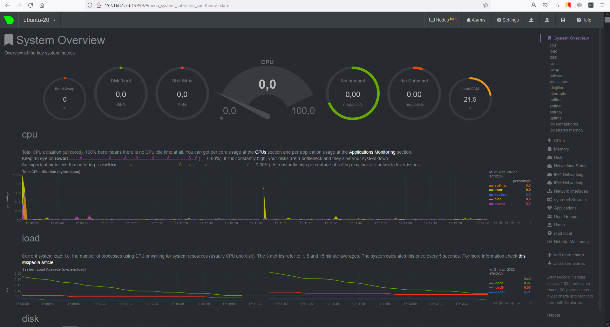
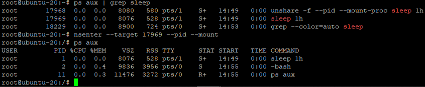

# Домашнее задание к занятию "3.4. Операционные системы, лекция 2"
1. Последовательность действий:
   1. Создаем файл сервиса в директории ```/etc/systemd/system/``` с окончанием ```.service```. В моём случае: ```/etc/systemd/system/node_exporter.service```
   2. Запроняем файл необходимой нам конфигурацией
   3. Выполняем ```systemctl daemon-reload``` для того чтобы systemd загрузил новый unit файл.
   4. Выполняем ```systemctl enable node_exporter``` для включения автозапуска нашего сервиса.
   5. Выполняем ```systemctl start node_exporter``` для запуска сервиса.  
    
   Пример созданного мной unit файла можно найти [здесь](./unit%20files/node_exporter.service), файла с переменной дополнительных опций для запуска [здесь](./unit%20files/node_exporter_opts).
2. Опции которые я выбрал бы для базового мониторига хоста:  
   1. CPU
      * node_cpu_seconds_total{cpu="0",mode="idle"} 3626.75
      * node_cpu_seconds_total{cpu="0",mode="iowait"} 2.76
      * node_cpu_seconds_total{cpu="0",mode="irq"} 0
      * node_cpu_seconds_total{cpu="0",mode="nice"} 19.12
      * node_cpu_seconds_total{cpu="0",mode="softirq"} 0.83
      * node_cpu_seconds_total{cpu="0",mode="steal"} 0
      * node_cpu_seconds_total{cpu="0",mode="system"} 13.63
      * node_cpu_seconds_total{cpu="0",mode="user"} 10.35
   2. RAM
      * node_memory_MemAvailable_bytes
      * node_memory_MemFree_bytes
      * node_memory_MemTotal_bytes
   3. DISK
      * node_filesystem_avail_bytes
      * node_filesystem_size_bytes
      * node_disk_read_time_seconds_total
      * node_disk_reads_completed_total
      * node_disk_write_time_seconds_total
      * node_disk_writes_completed_total
      * node_disk_io_now
   4. Network
      * node_netstat_Tcp_ActiveOpens
      * node_netstat_Tcp_CurrEstab
      * node_network_receive_bytes_total
      * node_network_receive_packets_total
      * node_network_receive_errs_total
      * node_network_transmit_bytes_total
      * node_network_transmit_packets_total
      * node_network_transmit_errs_total
3. Netdata успешно установлен:
   
4. Можно по параметру DMI.  
   В моём случае параметр следующий: ```DMI: Microsoft Corporation Virtual Machine/Virtual Machine, BIOS Hyper-V UEFI Release v4.0 11/01/2019```  
   Yandex cloud: ```DMI: Yandex xeon-gold-6338/xeon-gold-6338, BIOS 1.11.1-1 04/01/2014```
5. Лимит в системе по умолчанию: ```fs.nr_open = 1048576```  
   Этот параметр ограничивает максимальное количество файловых дескрипторов которые может занять процесс.  
   Предполагаю что достичь этого предела не позволяет параметр ```open files``` из вывода команды ```ulimits```
6. Демонстрация что процесс работает под PID 1 в отдельном NameSpace:  
   
7. Конструкция ```:(){ :|:& };:``` является описанием функции которая создаёт 2 экземпляра самой себя, те в свою очередь делают тоже самое и т.д. Всё автоматически стабилизировалось т.к. в системе есть ограничение на максимальное количество PID для сессии. Изменить максимальное количество PID можно в файле ```/proc/sys/kernel/pid_max```